Based on
<https://satijalab.org/seurat/articles/integration_introduction.html>

``` r
suppressWarnings(library(Seurat))
```

    ## Registered S3 method overwritten by 'spatstat.geom':
    ##   method     from
    ##   print.boxx cli

    ## Attaching SeuratObject

``` r
suppressWarnings(library(SeuratData))
```

    ## -- Installed datasets ------------------------------------- SeuratData v0.2.1 --

    ## v ifnb   3.1.0                          v pbmc3k 3.1.4

    ## -------------------------------------- Key -------------------------------------

    ## v Dataset loaded successfully
    ## > Dataset built with a newer version of Seurat than installed
    ## (?) Unknown version of Seurat installed

``` r
suppressWarnings(library(patchwork))
```

# Chapter 1 - Build an merged Seurat Object using own data

You can also load your own data using the read10x function Make sure you
have all three file in the correct directory

1.  matrix.mtx
2.  genes.tsv
3.  barcodes.tsv

``` r
URL <- "D:/Documents/GitHub/Introduction-to-Seurat-Package/pbmc3k_filtered_gene_bc_matrices/filtered_gene_bc_matrices/hg19"

# Load the PBMC dataset1
pbmc.data1 <- Read10X(data.dir = URL)
# Initialize the Seurat object with the raw (non-normalized data).
ctrl <- CreateSeuratObject(counts = pbmc.data1, project = "pbmc3k", min.cells = 300, min.features = 200)

# Load the PBMC dataset2
pbmc.data2 <- Read10X(data.dir = URL)
# Initialize the Seurat object with the raw (non-normalized data).
stim <- CreateSeuratObject(counts = pbmc.data2, project = "pbmc3k", min.cells = 600, min.features = 200)

pmbc.list <- list(ctrl,stim)
```

``` r
merged.pbmc <- merge(x = ctrl, y = stim, add.cell.ids = c("3K", "4K"))

#more than one sample
#merged.pbmc <- merge(x = ctrl, y = c(stim1,stim2,stim3))

#Example from seurat
#https://satijalab.org/seurat/articles/merge_vignette.html
#pbmc.big <- merge(pbmc3k, y = c(pbmc4k, pbmc8k), add.cell.ids = c("3K", "4K", "8K"), project = "PBMC15K")
#pbmc.big
```

# Chapter 1 - Adding MetaData

``` r
library(stringr)
sample <- names(merged.pbmc@active.ident)
sample_detect <- ifelse(str_detect(sample,"3K"),"3K","4K")

merged.pbmc@meta.data$sample <- sample_detect

Idents(object = merged.pbmc) <- "sample"
```

# Chapter 1 - Normalized Data and Intergrate the two dataset

``` r
pmbc.list <-  SplitObject(merged.pbmc, split.by = "sample")

# perform standard preprocessing on each object
for (i in 1:length(pmbc.list)) {
  pmbc.list[[i]] <- NormalizeData(pmbc.list[[i]], verbose = FALSE)
  pmbc.list[[i]] <- subset(pmbc.list[[i]], downsample = 1000)
  pmbc.list[[i]] <- FindVariableFeatures(
    pmbc.list[[i]], selection.method = "vst",
    nfeatures = 2000, verbose = FALSE
  )
}

# select features that are repeatedly variable across datasets for integration run PCA on each
# dataset using these features
features <- SelectIntegrationFeatures(object.list = pmbc.list)
pmbc.list <- lapply(X = pmbc.list, FUN = function(x) {
    x <- ScaleData(x, features = features, verbose = FALSE)
    x <- RunPCA(x, features = features, verbose = FALSE)
})
```

# Chapter 1 - Intergrate Data

``` r
#####################
# find anchors
anchors <- FindIntegrationAnchors(object.list = pmbc.list)
```

    ## Computing 2000 integration features

    ## Scaling features for provided objects

    ## Finding all pairwise anchors

    ## Running CCA

    ## Merging objects

    ## Finding neighborhoods

    ## Finding anchors

    ##  Found 3803 anchors

    ## Filtering anchors

    ##  Retained 3018 anchors

``` r
# integrate data
merged.pbmc <- IntegrateData(anchorset = anchors)
```

    ## Merging dataset 2 into 1

    ## Extracting anchors for merged samples

    ## Finding integration vectors

    ## Finding integration vector weights

    ## Integrating data

# Chapter 1.2 - Data Cleaning and Dimensional reduction for visualization

``` r
# Run the standard workflow for visualization and clustering
merged.pbmc <- ScaleData(merged.pbmc, verbose = FALSE)
merged.pbmc <- FindVariableFeatures(merged.pbmc, 
                                    selection.method = "vst",
                                    nfeatures = 2000, 
                                    verbose = FALSE)
```

    ## Warning in FindVariableFeatures.Assay(object = assay.data, selection.method =
    ## selection.method, : selection.method set to 'vst' but count slot is empty; will
    ## use data slot instead

``` r
merged.pbmc <- RunPCA(merged.pbmc, npcs = 30, verbose = FALSE)
merged.pbmc <- RunUMAP(merged.pbmc, reduction = "pca", dims = 1:30)
```

    ## Warning: The default method for RunUMAP has changed from calling Python UMAP via reticulate to the R-native UWOT using the cosine metric
    ## To use Python UMAP via reticulate, set umap.method to 'umap-learn' and metric to 'correlation'
    ## This message will be shown once per session

    ## 13:14:12 UMAP embedding parameters a = 0.9922 b = 1.112

    ## 13:14:12 Read 2000 rows and found 30 numeric columns

    ## 13:14:12 Using Annoy for neighbor search, n_neighbors = 30

    ## 13:14:12 Building Annoy index with metric = cosine, n_trees = 50

    ## 0%   10   20   30   40   50   60   70   80   90   100%

    ## [----|----|----|----|----|----|----|----|----|----|

    ## **************************************************|
    ## 13:14:13 Writing NN index file to temp file C:\Users\harpa\AppData\Local\Temp\RtmpQV6obQ\file3b945fe1326e
    ## 13:14:13 Searching Annoy index using 1 thread, search_k = 3000
    ## 13:14:13 Annoy recall = 100%
    ## 13:14:14 Commencing smooth kNN distance calibration using 1 thread
    ## 13:14:14 Initializing from normalized Laplacian + noise
    ## 13:14:14 Commencing optimization for 500 epochs, with 90866 positive edges
    ## 13:14:23 Optimization finished

``` r
merged.pbmc <- FindNeighbors(merged.pbmc, reduction = "pca", dims = 1:30)
```

    ## Computing nearest neighbor graph
    ## Computing SNN

``` r
merged.pbmc <- FindClusters(merged.pbmc, resolution = 0.5)
```

    ## Modularity Optimizer version 1.3.0 by Ludo Waltman and Nees Jan van Eck
    ## 
    ## Number of nodes: 2000
    ## Number of edges: 113355
    ## 
    ## Running Louvain algorithm...
    ## Maximum modularity in 10 random starts: 0.8722
    ## Number of communities: 9
    ## Elapsed time: 0 seconds

``` r
gc()
```

    ##            used  (Mb) gc trigger  (Mb) max used  (Mb)
    ## Ncells  2768169 147.9    5367582 286.7  5367582 286.7
    ## Vcells 37097706 283.1   84887931 647.7 82907491 632.6

``` r
# Visualization

p1 <- DimPlot(merged.pbmc, reduction = "umap")
p1
```

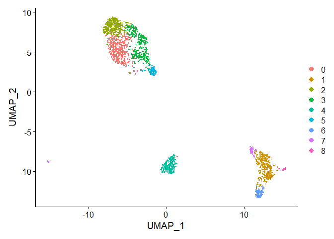<!-- -->

``` r
Idents(object = merged.pbmc) <- "sample"
p2 <- DimPlot(merged.pbmc, reduction = "umap")
p2
```

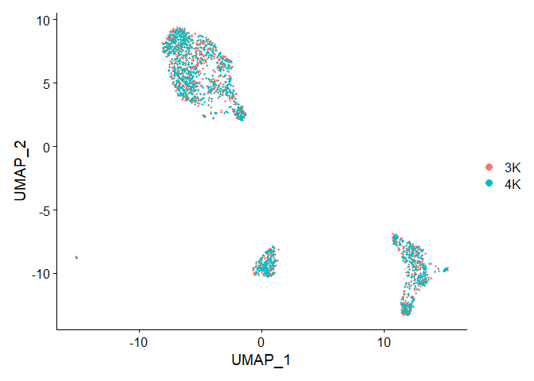<!-- -->

``` r
p1+p2
```

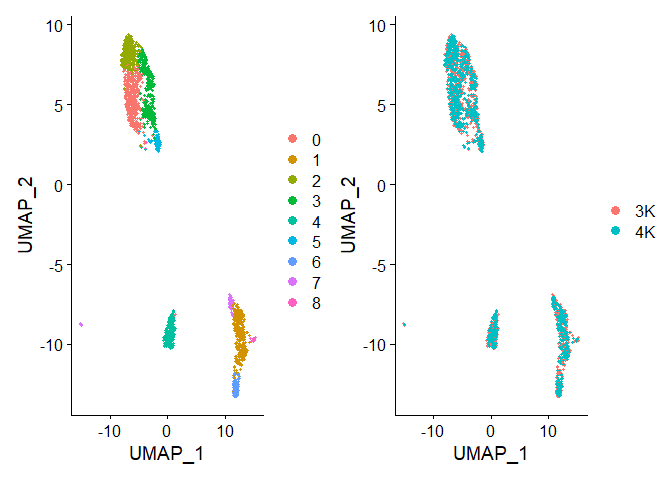<!-- -->

``` r
# Find differentially expressed features between CD14+ Monocytes and all other cells, only
# search for positive markers
Idents(object = merged.pbmc) <- "sample"

sammple.markers <- FindMarkers(merged.pbmc, ident.1 = "3K", ident.2 = "4K")
# view results
head(sammple.markers)
```

    ##                  p_val avg_log2FC pct.1 pct.2     p_val_adj
    ## EBP      1.504473e-238  0.3406139 0.094 0.999 2.846463e-235
    ## MLX      1.389999e-231  0.3645216 0.100 1.000 2.629877e-228
    ## CARD8    1.389999e-231  0.3642012 0.100 1.000 2.629878e-228
    ## RFXANK   1.300650e-228  0.3218905 0.101 0.996 2.460830e-225
    ## CYB561D2 3.550510e-228  0.3677264 0.101 0.995 6.717564e-225
    ## HAGH     6.276764e-228  0.4230465 0.103 1.000 1.187564e-224

``` r
# There shouldn't be any, but.........

library(ComplexHeatmap)
```

    ## Loading required package: grid

    ## ========================================
    ## ComplexHeatmap version 2.11.1
    ## Bioconductor page: http://bioconductor.org/packages/ComplexHeatmap/
    ## Github page: https://github.com/jokergoo/ComplexHeatmap
    ## Documentation: http://jokergoo.github.io/ComplexHeatmap-reference
    ## 
    ## If you use it in published research, please cite:
    ## Gu, Z. Complex heatmaps reveal patterns and correlations in multidimensional 
    ##   genomic data. Bioinformatics 2016.
    ## 
    ## The new InteractiveComplexHeatmap package can directly export static 
    ## complex heatmaps into an interactive Shiny app with zero effort. Have a try!
    ## 
    ## This message can be suppressed by:
    ##   suppressPackageStartupMessages(library(ComplexHeatmap))
    ## ========================================

``` r
heatmapdf <- sammple.markers[1:25,]
row_ha = rowAnnotation("CD14+ Mono" = anno_barplot(heatmapdf$pct.1),
                       "Others"= anno_barplot(heatmapdf$pct.2),
                       width = unit(10, "cm"))

ht0 <- Heatmap(heatmapdf$avg_log2FC,
                name = "Log2FC",
                cluster_rows = TRUE, 
                row_labels = rownames(heatmapdf), 
                right_annotation = row_ha,
                width = unit(1, "cm"))

ht0
```

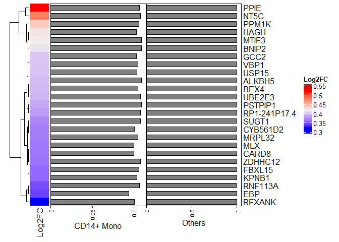<!-- -->

``` r
# Find differentially expressed features between CD14+ Monocytes and all other cells, only
# search for positive markers
Idents(object = merged.pbmc) <- "seurat_clusters"

cluster1.de.markers <- FindMarkers(merged.pbmc, ident.1 = "0", ident.2 = NULL, only.pos = TRUE)
# view results
head(cluster1.de.markers)
```

    ##             p_val avg_log2FC pct.1 pct.2    p_val_adj
    ## LTB  2.122043e-87  1.4506039 0.983 0.700 4.014906e-84
    ## LDHB 5.833112e-72  1.0527473 0.961 0.664 1.103625e-68
    ## IL32 1.055335e-70  1.0788059 0.939 0.601 1.996693e-67
    ## TPT1 2.409722e-52  0.5544837 1.000 0.985 4.559194e-49
    ## AQP3 2.515788e-52  1.1517965 0.678 0.463 4.759870e-49
    ## IL7R 3.722894e-51  1.4124211 0.763 0.442 7.043715e-48

``` r
library(ComplexHeatmap)

heatmapdf <- cluster1.de.markers[1:25,]
row_ha = rowAnnotation("CD14+ Mono" = anno_barplot(heatmapdf$pct.1),
                       "Others"= anno_barplot(heatmapdf$pct.2),
                       width = unit(10, "cm"))

ht1 <- Heatmap(heatmapdf$avg_log2FC,
                name = "Log2FC",
                cluster_rows = TRUE, 
                row_labels = rownames(heatmapdf), 
                right_annotation = row_ha,
                width = unit(1, "cm"))

ht1
```

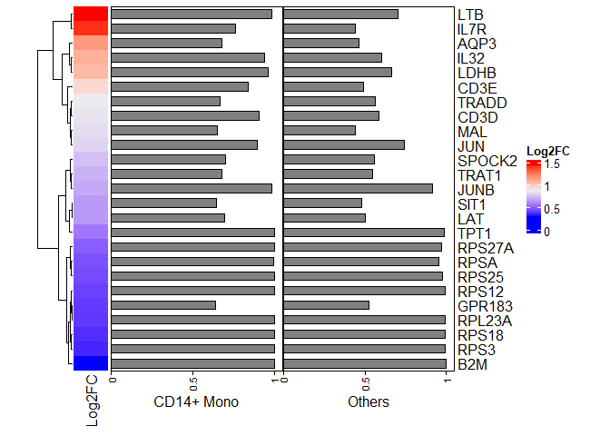<!-- -->

#################################################################### 

# Chapter 2 - Using ifnb Dataset (The proper way)

``` r
# install dataset for the first time
#InstallData("ifnb")

# load dataset
suppressWarnings(suppressMessages(LoadData("ifnb")))
```

    ## An object of class Seurat 
    ## 14053 features across 13999 samples within 1 assay 
    ## Active assay: RNA (14053 features, 0 variable features)

``` r
ifnb <- ifnb

#?ifnb
```

``` r
# split the dataset into a list of two seurat objects (stim and CTRL)
ifnb.list <- SplitObject(ifnb, split.by = "stim")
ifnb.list <- lapply(X = ifnb.list, FUN = NormalizeData)

# normalize and identify variable features for each dataset independently
ifnb.list <- lapply(X = ifnb.list, FUN = function(x) {
    x <- subset(x, downsample = 1000)
    x <- FindVariableFeatures(x, selection.method = "vst", nfeatures = 2000)
    
})
```

# Chapter 2 - Feature selection

``` r
# select features that are repeatedly variable across datasets for integration
features <- SelectIntegrationFeatures(object.list = ifnb.list)
```

``` r
immune.anchors <- FindIntegrationAnchors(object.list = ifnb.list, anchor.features = features)
```

    ## Scaling features for provided objects

    ## Finding all pairwise anchors

    ## Running CCA

    ## Merging objects

    ## Finding neighborhoods

    ## Finding anchors

    ##  Found 3188 anchors

    ## Filtering anchors

    ##  Retained 2460 anchors

``` r
# this command creates an 'integrated' data assay
immune.combined <- IntegrateData(anchorset = immune.anchors)
```

    ## Merging dataset 2 into 1

    ## Extracting anchors for merged samples

    ## Finding integration vectors

    ## Finding integration vector weights

    ## Integrating data

# Chapter 2 - Data Procecssing

``` r
# specify that we will perform downstream analysis on the corrected data note that the
# original unmodified data still resides in the 'RNA' assay
DefaultAssay(immune.combined) <- "integrated"

# Run the standard workflow for visualization and clustering
immune.combined <- ScaleData(immune.combined, verbose = FALSE)
immune.combined <- RunPCA(immune.combined, npcs = 30, verbose = FALSE)
immune.combined <- RunUMAP(immune.combined, reduction = "pca", dims = 1:30)
```

    ## 13:15:24 UMAP embedding parameters a = 0.9922 b = 1.112

    ## 13:15:24 Read 2000 rows and found 30 numeric columns

    ## 13:15:24 Using Annoy for neighbor search, n_neighbors = 30

    ## 13:15:24 Building Annoy index with metric = cosine, n_trees = 50

    ## 0%   10   20   30   40   50   60   70   80   90   100%

    ## [----|----|----|----|----|----|----|----|----|----|

    ## **************************************************|
    ## 13:15:25 Writing NN index file to temp file C:\Users\harpa\AppData\Local\Temp\RtmpQV6obQ\file3b94734c3976
    ## 13:15:25 Searching Annoy index using 1 thread, search_k = 3000
    ## 13:15:25 Annoy recall = 100%
    ## 13:15:26 Commencing smooth kNN distance calibration using 1 thread
    ## 13:15:27 Initializing from normalized Laplacian + noise
    ## 13:15:27 Commencing optimization for 500 epochs, with 84996 positive edges
    ## 13:15:36 Optimization finished

``` r
immune.combined <- FindNeighbors(immune.combined, reduction = "pca", dims = 1:30)
```

    ## Computing nearest neighbor graph
    ## Computing SNN

``` r
immune.combined <- FindClusters(immune.combined, resolution = 0.5)
```

    ## Modularity Optimizer version 1.3.0 by Ludo Waltman and Nees Jan van Eck
    ## 
    ## Number of nodes: 2000
    ## Number of edges: 102425
    ## 
    ## Running Louvain algorithm...
    ## Maximum modularity in 10 random starts: 0.8758
    ## Number of communities: 10
    ## Elapsed time: 0 seconds

``` r
gc()
```

    ##            used  (Mb) gc trigger   (Mb)  max used   (Mb)
    ## Ncells  4634480 247.6    9451438  504.8   9451438  504.8
    ## Vcells 89072648 679.6  184431107 1407.1 184430469 1407.1

# Chapter 2 - Visualise Data

``` r
# Visualization
p1 <- DimPlot(immune.combined, reduction = "umap", group.by = "stim")
p1
```

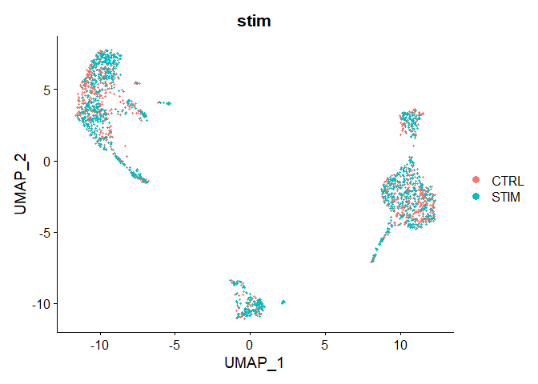<!-- -->

``` r
p2 <- DimPlot(immune.combined, reduction = "umap", label = TRUE, repel = TRUE)
p2
```

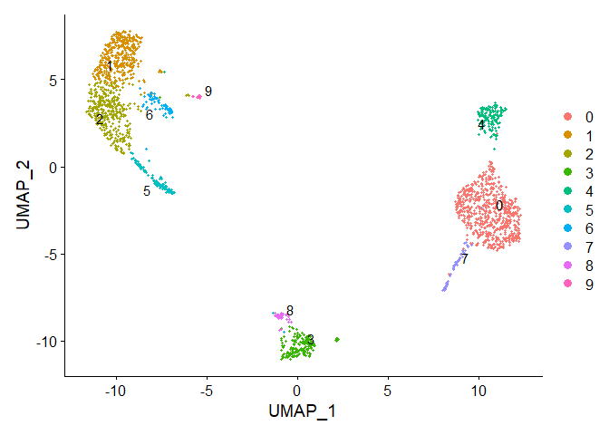<!-- -->

``` r
p1 + p2
```

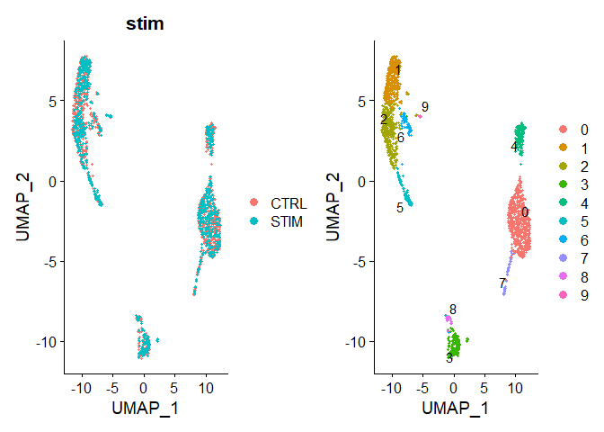<!-- -->

# Chapter 2 - Identify conserved cell type markers

``` r
# For performing differential expression after integration, we switch back to the original
# data
DefaultAssay(immune.combined) <- "RNA"
nk.markers <- FindConservedMarkers(immune.combined, ident.1 = 6, grouping.var = "stim", verbose = FALSE)

#https://www.biostars.org/p/409790/

#FindMarkers will find markers between two different identity groups - you have to specify both #identity groups. This is useful for comparing the differences between two specific groups.

#FindAllMarkers will find markers differentially expressed in each identity group by comparing #it to all of the others - you don't have to manually define anything. Note that markers may #bleed over between closely-related groups - they are not forced to be specific to only one #group. This is what most people use (and likely what you want).

#FindConservedMarkers will find markers that are conserved between two groups - this can be #useful if you want to find markers that are conserved between a treated and untreated condition #for a specific cell type or group of cells. It means they are differentially expressed compared #to other groups, but have similar expression between the two groups you're actually comparing.

head(nk.markers)
```

    ##          CTRL_p_val CTRL_avg_log2FC CTRL_pct.1 CTRL_pct.2 CTRL_p_val_adj
    ## SNHG12 1.612457e-52        2.255337      0.463      0.017   2.265985e-48
    ## HSPH1  6.420468e-31        2.951868      0.634      0.088   9.022683e-27
    ## SCML1  1.689201e-29        2.154189      0.341      0.021   2.373834e-25
    ## SRSF2  3.068016e-29        2.743712      0.854      0.217   4.311482e-25
    ## CLK1   4.662395e-27        2.311505      0.585      0.083   6.552063e-23
    ## NOP58  9.024730e-25        2.290002      0.561      0.081   1.268245e-20
    ##          STIM_p_val STIM_avg_log2FC STIM_pct.1 STIM_pct.2 STIM_p_val_adj
    ## SNHG12 9.064908e-32        1.776018      0.292      0.007   1.273892e-27
    ## HSPH1  5.851049e-11        2.792827      0.542      0.127   8.222480e-07
    ## SCML1  9.315024e-21        2.278457      0.417      0.034   1.309040e-16
    ## SRSF2  2.620323e-11        2.535208      0.667      0.186   3.682340e-07
    ## CLK1   1.253029e-15        2.535546      0.542      0.083   1.760882e-11
    ## NOP58  1.869061e-15        2.361140      0.583      0.096   2.626592e-11
    ##            max_pval minimump_p_val
    ## SNHG12 9.064908e-32   3.224913e-52
    ## HSPH1  5.851049e-11   1.284094e-30
    ## SCML1  9.315024e-21   3.378401e-29
    ## SRSF2  2.620323e-11   6.136031e-29
    ## CLK1   1.253029e-15   9.324790e-27
    ## NOP58  1.869061e-15   1.804946e-24

``` r
FeaturePlot(immune.combined, features = c("CD3D", "SELL", "CREM", "CD8A", "GNLY", "CD79A", "FCGR3A", "CCL2", "PPBP"), min.cutoff = "q9",pt.size = 2)
```

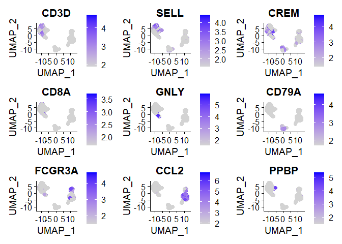<!-- -->
\# Chapter 2 - Renaming clusters

``` r
levels(immune.combined)
```

    ##  [1] "0" "1" "2" "3" "4" "5" "6" "7" "8" "9"

``` r
renamed.immune.combined <- RenameIdents(immune.combined, "1"= "new 1") 
levels(renamed.immune.combined)
```

    ##  [1] "new 1" "0"     "2"     "3"     "4"     "5"     "6"     "7"     "8"    
    ## [10] "9"

# Chapter 2 - Dimplot with new cluster names

``` r
immune.combined <- RenameIdents(immune.combined, "0" = "CD14 Mono", "1" = "CD4 Naive T", "2" = "CD4 Memory T","3" = "CD16 Mono", "4" = "B", "5" = "CD8 T", "6" = "NK", "7" = "T activated", "8" = "DC", "9" = "B Activated", "10" = "Mk", "11" = "pDC", "12" = "Eryth", "13" = "Mono/Mk Doublets", "14" = "HSPC")
```

    ## Warning: Cannot find identity 14

    ## Warning: Cannot find identity 13

    ## Warning: Cannot find identity 12

    ## Warning: Cannot find identity 11

    ## Warning: Cannot find identity 10

``` r
levels(immune.combined)
```

    ##  [1] "CD14 Mono"    "CD4 Naive T"  "CD4 Memory T" "CD16 Mono"    "B"           
    ##  [6] "CD8 T"        "NK"           "T activated"  "DC"           "B Activated"

``` r
table(Idents(object = immune.combined))
```

    ## 
    ##    CD14 Mono  CD4 Naive T CD4 Memory T    CD16 Mono            B        CD8 T 
    ##          640          386          356          179          151          111 
    ##           NK  T activated           DC  B Activated 
    ##           65           64           34           14

``` r
DimPlot(immune.combined, label = TRUE)
```

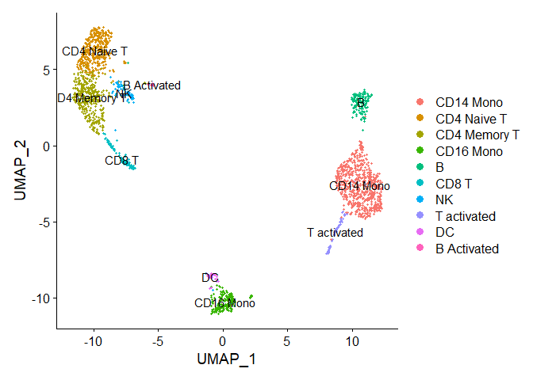<!-- -->

``` r
Idents(immune.combined) <- factor(Idents(immune.combined), levels = c("HSPC", "Mono/Mk Doublets","pDC", "Eryth", "Mk", "DC", "CD14 Mono", "CD16 Mono", "B Activated", "B", "CD8 T", "NK", "T activated","CD4 Naive T", "CD4 Memory T"))
```

``` r
markers.to.plot <- c("CD3D", "CREM", "HSPH1", "SELL", "GIMAP5", "CACYBP", "GNLY", "NKG7", "CCL5", "CD8A", "MS4A1", "CD79A", "MIR155HG", "NME1", "FCGR3A", "VMO1", "CCL2", "S100A9", "HLA-DQA1","GPR183", "PPBP", "GNG11", "HBA2", "HBB", "TSPAN13", "IL3RA", "IGJ", "PRSS57")
```

# Chapter 2 - Dotplot

``` r
DotPlot(immune.combined, features = markers.to.plot, cols = c("blue", "red"), dot.scale = 8, split.by = "stim") + RotatedAxis()
```

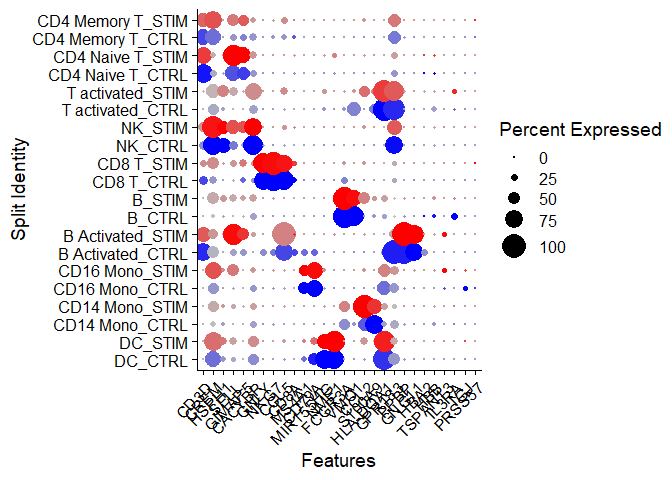<!-- -->

# Chapter 2 - Identify differential expressed genes across conditions

``` r
library(ggplot2)
```

    ## Warning: package 'ggplot2' was built under R version 4.1.2

``` r
library(cowplot)
```

    ## 
    ## Attaching package: 'cowplot'

    ## The following object is masked from 'package:patchwork':
    ## 
    ##     align_plots

``` r
theme_set(theme_cowplot())
t.cells <- subset(immune.combined, idents = "CD4 Naive T")
Idents(t.cells) <- "stim"
avg.t.cells <- as.data.frame(log1p(AverageExpression(t.cells, verbose = FALSE)$RNA))
avg.t.cells$gene <- rownames(avg.t.cells)

cd14.mono <- subset(immune.combined, idents = "CD14 Mono")
Idents(cd14.mono) <- "stim"
avg.cd14.mono <- as.data.frame(log1p(AverageExpression(cd14.mono, verbose = FALSE)$RNA))
avg.cd14.mono$gene <- rownames(avg.cd14.mono)

genes.to.label = c("ISG15", "LY6E", "IFI6", "ISG20", "MX1", "IFIT2", "IFIT1", "CXCL10", "CCL8")
p1 <- ggplot(avg.t.cells, aes(CTRL, STIM)) + geom_point() + ggtitle("CD4 Naive T Cells")
p1 <- LabelPoints(plot = p1, points = genes.to.label, repel = TRUE)
```

    ## When using repel, set xnudge and ynudge to 0 for optimal results

``` r
p2 <- ggplot(avg.cd14.mono, aes(CTRL, STIM)) + geom_point() + ggtitle("CD14 Monocytes")
p2 <- LabelPoints(plot = p2, points = genes.to.label, repel = TRUE)
```

    ## When using repel, set xnudge and ynudge to 0 for optimal results

``` r
p1 + p2
```

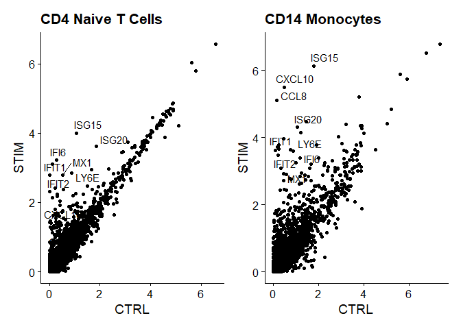<!-- -->
\# Chapter 2 - Inteferon response

``` r
immune.combined$celltype.stim <- paste(Idents(immune.combined), immune.combined$stim, sep = "_")
immune.combined$celltype <- Idents(immune.combined)
Idents(immune.combined) <- "celltype.stim"

b.interferon.response <- FindMarkers(immune.combined, ident.1 = "B_STIM", ident.2 = "B_CTRL", verbose = FALSE)

head(b.interferon.response, n = 15)
```

    ##                 p_val avg_log2FC pct.1 pct.2    p_val_adj
    ## IFIT1    1.166508e-28   4.521337 1.000 0.071 1.639293e-24
    ## IFIT3    3.708120e-27   3.986884 1.000 0.298 5.211021e-23
    ## IFITM3   4.715986e-26   2.958064 1.000 0.690 6.627375e-22
    ## ISG15    4.854345e-26   4.917321 1.000 0.500 6.821811e-22
    ## ISG20    8.180154e-26   3.478169 1.000 0.464 1.149557e-21
    ## IFIT2    9.153945e-26   3.319417 1.000 0.214 1.286404e-21
    ## IFI6     1.108080e-25   3.122246 1.000 0.357 1.557184e-21
    ## LY6E     1.882624e-25   2.822519 1.000 0.440 2.645651e-21
    ## APOBEC3A 1.514663e-24   3.352339 1.000 0.452 2.128555e-20
    ## OASL     1.793719e-24   3.087877 0.955 0.179 2.520713e-20
    ## CXCL10   7.132351e-24   3.939777 1.000 0.333 1.002309e-19
    ## MX1      7.954234e-24   3.088767 0.955 0.131 1.117809e-19
    ## TNFSF10  9.491629e-24   2.687823 1.000 0.512 1.333859e-19
    ## RSAD2    9.691537e-24   3.354510 0.925 0.119 1.361952e-19
    ## CXCL11   1.453433e-22   3.924294 0.851 0.036 2.042510e-18

``` r
FeaturePlot(immune.combined, features = c("CD3D", "GNLY", "IFI6"), split.by = "stim", max.cutoff = 2, cols = c("grey", "red"))
```

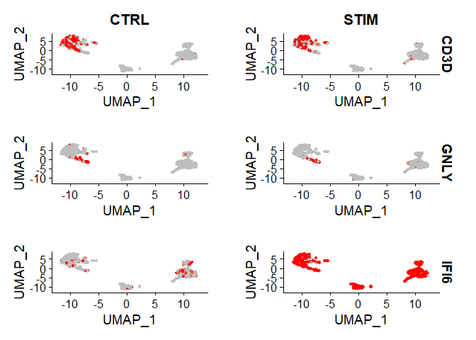<!-- -->
\# Chapter 2 - Violin plot on different conditions

``` r
plots <- VlnPlot(immune.combined, features = c("ISG15", "CXCL10"), split.by = "stim", group.by = "celltype", pt.size = 0, combine = FALSE)
```

    ## The default behaviour of split.by has changed.
    ## Separate violin plots are now plotted side-by-side.
    ## To restore the old behaviour of a single split violin,
    ## set split.plot = TRUE.
    ##       
    ## This message will be shown once per session.

``` r
wrap_plots(plots = plots, ncol = 1)
```

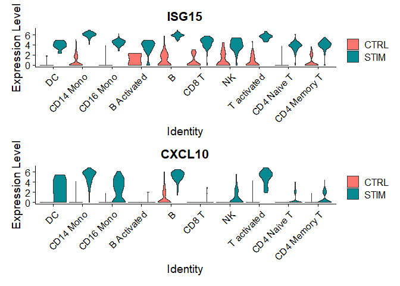<!-- -->
